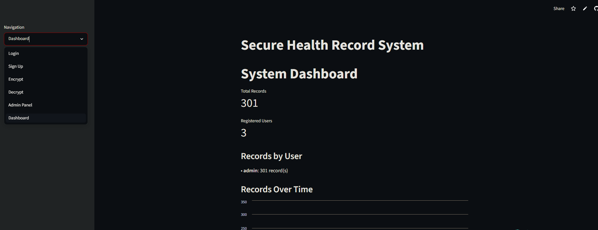

> This was a college course project for Cryptography.

# Secure Hospital Database

A role-based secure hospital record management system built with Streamlit. This application encrypts and decrypts patient data using a combination of RSA and AES cryptography, with user access controlled by roles and permissions.

## Live demo 
https://aes-and-rsa-immu10.streamlit.app/

**Demo login (Admin):** username `admin` · password `admin`

## Screenshot 




## Overview

Secure Hospital Database is a prototype that demonstrates how a hybrid cryptosystem can protect sensitive medical records while still allowing role-appropriate access. Each patient record is encrypted with a fresh AES key, and that AES key is in turn wrapped with the RSA public key of every role allowed to read the record. Only a user holding the matching RSA private key can unwrap the AES key and decrypt the data.

Users are assigned one of four roles — **Admin**, **Doctor**, **Nurse**, or **Intern** — which control both what they can read and whether they can write new records. Because the RSA keypairs are generated once and stored on disk, encrypted data remains accessible across sessions and application restarts. The project is intentionally scoped as a course demonstration of applied cryptography rather than a production system.

## Roles & Permissions

Every user is assigned one of four roles. A role controls two independent things: **write access** (a `can_write` flag, checked when encrypting) and **read access** (which is determined entirely by whether an RSA keypair exists for that role). Records are only ever wrapped for the roles in `AUTHORIZED_ROLES` (`Doctor`, `Admin`) in `data.py`, and `generator.py` only generates keys for `Doctor` and `Admin` — so only those two roles can decrypt anything.

| Role | Create / manage accounts | Write (encrypt) records | Read (decrypt) records | Admin Panel | Dashboard | Delete records |
|------|:---:|:---:|:---:|:---:|:---:|:---:|
| **Admin** | ✅ | ✅ | ✅ | ✅ | ✅ | ✅ |
| **Doctor** | ❌ | ✅ | ✅ | ❌ | ❌ | ❌ |
| **Nurse** | ❌ | ✅ | ❌¹ | ❌ | ❌ | ❌ |
| **Intern** | ❌ | ❌² | ❌¹ | ❌ | ❌ | ❌ |

**Notes:**

1. **Nurses and Interns cannot read any records.** There is no RSA keypair for these roles, so the decrypt screen reports *"Private key not found for this role."* A Nurse can therefore submit records that they (and other Nurses/Interns) can never read back — only Doctors and Admins can.
2. **Interns have no write access by default.** An Admin can grant or revoke an individual Intern's write permission from the Admin Panel (*Manage Intern Write Access*). Even with write access, an Intern still cannot read records.

### What each role can do

- **Admin** — Full access. Creates and revokes user accounts, grants/revokes Intern write access (Admin Panel), encrypts and decrypts records, deletes individual records (from the Decrypt screen), and views the system Dashboard. Holds an RSA key, so it can read every record.
- **Doctor** — Can encrypt new records and decrypt any record it is authorized for. Holds an RSA key. Cannot manage users or access the Admin Panel / Dashboard. (Doctors are also tagged with a `Cardiology` specialty attribute at sign-up.)
- **Nurse** — Can encrypt new records but **cannot decrypt** any record (no RSA key). No account management or admin features.
- **Intern** — Read-only role by default with **no write access** unless an Admin grants it, and **cannot decrypt** records (no RSA key).

### Account creation & the override code

Creating an account requires either being logged in as an Admin, or supplying the **registration override code** on the Sign Up screen (`REGISTRATION_OVERRIDE_CODE` in `main.py`, hardcoded for the demo). This is the only path for a non-Admin to bootstrap an account; in a real deployment it should be removed or replaced with a secure invite mechanism.

> **Note:** To enable reading for additional roles (e.g. Nurse), you would need to add the role to `AUTHORIZED_ROLES` in `data.py` and generate a keypair for it in `generator.py`.

## Architecture

The system follows a hybrid (envelope) encryption model layered on top of a simple Streamlit front end.

### High-level overview

```
                          +---------------------------+
            User -------> |   Streamlit UI (main.py)  |
                          +-------------+-------------+
                                        |
                  +---------------------+---------------------+
                  |                                           |
                  v                                           v
      +-----------------------+                   +-----------------------+
      |   Authentication      |                   |   Encryption layer    |
      | login.py /            |                   |        data.py        |
      | create_user.py        |                   +-----+-----------+-----+
      +-----------+-----------+                         |           |
                  |                                     |           |
                  v                                     v           v
        +-------------------+              +-------------------+  +-------------------+
        |    logins.txt     |              |      keys/        |  |    records.txt    |
        | bcrypt-hashed     |              | RSA keypairs      |  | encrypted records |
        | users             |              | per role          |  |                   |
        +-------------------+              +---------+---------+  +-------------------+
                                                     ^
                                                     | generates
                                             +-------+--------+
                                             | generator.py   |
                                             +----------------+
```

### Encryption flow (write)

An authorized user submits a record through a dynamic form defined in `fields.json`. `data.py` generates a fresh AES key + IV, encrypts the record, then wraps the AES key once per authorized role with that role's RSA public key.

```
   User fills record form (fields.json)
                 |
                 v
     Generate random AES key + IV
                 |
        +--------+-----------------------------+
        |                                      |
        v                                      v
  AES-CBC encrypt record           For each authorized role:
  (+ PKCS#7 padding)                 load role's RSA-2048 public key
        |                                      |
        |                                      v
        |                          RSA-OAEP encrypt AES key
        |                          (= per-role key envelope)
        |                                      |
        +------------------+-------------------+
                           v
        Assemble JSON record:
        IV + ciphertext + {role -> encrypted key} map
                           |
                           v
        Append base64 JSON line to records.txt
```

### Decryption flow (read)

A user's role selects which RSA private key is loaded. For each record, the matching encrypted AES key is unwrapped and used to decrypt the ciphertext; records with no key for that role are reported as unauthorized.

```
   Logged-in user's role
            |
            v
   Load role's RSA-2048 private key from keys/
            |
            v
   For each record in records.txt:
            |
            v
   Encrypted AES key exists for this role? ----- No ----> Report: not authorized
            |
           Yes
            |
            v
   RSA-OAEP decrypt  -->  recover AES key
            |
            v
   AES-CBC decrypt ciphertext (using stored IV)
            |
            v
   Display decrypted record
```

### Authentication & access control

- Credentials live in JSON-formatted text files; passwords are hashed with **bcrypt** (salted) in `login.py` / `create_user.py`.
- Each user carries a list of attributes (role, optionally a specialty) and a `can_write` flag.
- `main.py` enforces role-based UI gating: only Admins see the Admin Panel and Dashboard, only users with write permission can encrypt, and only roles with a matching RSA key can decrypt a given record.

This design simulates **Attribute-Based Encryption (ABE)** behavior — a record can be made readable by multiple roles at once — using only RSA and AES primitives.

## Tech Stack

| Layer | Tools |
|-------|-------|
| Language | Python 3 |
| Web framework / UI | [Streamlit](https://streamlit.io/) |
| Cryptography | [PyCryptodome](https://pycryptodome.readthedocs.io/) — AES-128 (CBC) record encryption, RSA-2048 + PKCS1_OAEP key wrapping |
| Password hashing | [bcrypt](https://pypi.org/project/bcrypt/) (salted) |
| Data handling | pandas (dashboard charts), Python stdlib (`json`, `base64`, `datetime`, `os`) |
| Storage | Flat files — `records.txt` (JSON-lines), `logins.txt` (JSON), `keys/` (PEM RSA keypairs) |

## Features

- Role-based authentication and authorization
- RSA + AES hybrid encryption for secure record storage
- Persistent encryption keys enabling data access across sessions
- User management with Admin control panel for creating accounts and managing permissions
- Encryption and decryption of medical records through an easy-to-use interface
- Search functionality to filter patient records by name or diagnosis
- Admin dashboard displaying system statistics and record summaries

## Usage

- **Login:** Users log in with their credentials. Admin users can create accounts and manage permissions.

- **Sign Up:** New accounts require an admin override code or admin privileges.

- **Encrypt:** Authorized users can encrypt and save new patient records.

- **Decrypt:** Users can view decrypted records based on their role and permissions.

- **Admin Panel:** Admin users can revoke user access and manage intern write permissions.

- **Dashboard:** Displays key statistics about records and users.

## Project Structure

- `main.py` — Main Streamlit app handling UI and routing.

- `login.py` — User authentication and role verification.

- `create_user.py` — User registration logic.

- `data.py` — Encryption and decryption functions.

- `generator.py` — Script to generate RSA keys, required to initialize keys.

- `keys/` — Folder generated by `generator.py` that stores RSA key files (not included in the repo)

- `fields.json` — Defines input fields for medical records.

- `records.txt` — Encrypted medical records storage.

- `logins.txt` — User credentials and roles storage.


## Security Notes

- The registration override code is hardcoded for demonstration and should be replaced with a secure method in production.

- User passwords and sensitive data should be stored securely (hashed and salted) — please review before deployment.

- This project is a prototype and should be audited for security before use in a real hospital environment.


## Tags

AES · RSA ·  Envelope Encryption
